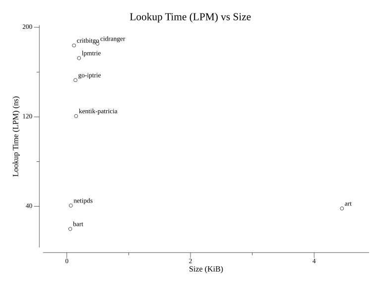
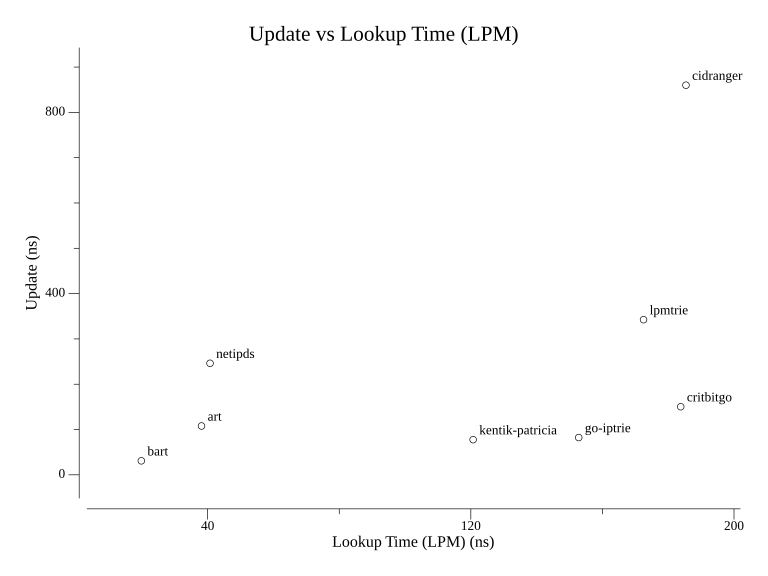
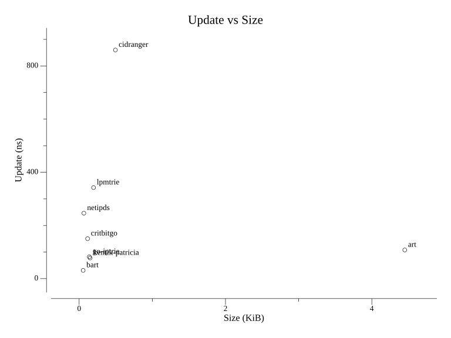

# netipds
[](https://pkg.go.dev/github.com/aromatt/netipds)
[](https://goreportcard.com/report/github.com/aromatt/netipds)
[](https://codecov.io/gh/aromatt/netipds)

This package builds on the
[netip](https://pkg.go.dev/net/netip) / [netipx](https://pkg.go.dev/go4.org/netipx)
family by adding two immutable, trie-based collection types for IP prefixes (CIDRs):
* `PrefixMap[T]` - a map from `netip.Prefix` to `T` with methods for fetching based on
  network relationships (subnets, supernets, longest-match, etc.)
* `PrefixSet` - a set of `netip.Prefix` values supporting CIDR-aware set operations
  (union, intersection, difference)

Both provide a rich set of queries enabled by a binary [radix
tree](https://en.wikipedia.org/wiki/Radix_tree).

### Goals
* **Efficiency.** This package aims to provide fast, immutable collection types for
  IP networks. According to the benchmarks at
  [iprbench](https://github.com/gaissmai/iprbench), it is one of the fastest and most
  memory-efficient packages among its peers.
* **Integration with `net/netip`.** This package is built on the shoulders of
  `net/netip`, leveraging its types and lessons both under the hood and at
  interfaces. See this excellent
  [post](https://tailscale.com/blog/netaddr-new-ip-type-for-go) by Tailscale about
  the history and benefits of `net/netip`.
* **Completeness.** Most open-source CIDR collection libraries lack several of the
  operations provided by `netipds`.

### Non-Goals
* **Mutability.** For use cases requiring continuous mutability, try
  [kentik/patricia](https://github.com/kentik/patricia) or
  [gaissmai/bart](https://github.com/gaissmai/bart).
* **Persistence.** This package is for data sets that fit in memory.
* **Other key types.** The collections in this package support exactly one key type:
  `netip.Prefix`.

## Usage
Like [netipx.IPSet](https://pkg.go.dev/go4.org/netipx#IPSet), `netipds` uses a
builder pattern to construct immutable PrefixMaps and PrefixSets.

Basic Example
```go
// Build a PrefixMap
builder := PrefixMapBuilder[string]{}
builder.Set(netip.MustParsePrefix("1.2.0.0/16"), "hello")

// This returns an immutable snapshot of the
// builder's state. The builder remains usable.
pm := builder.PrefixMap()

// Fetch an exact entry from the PrefixMap.
val, ok := pm.Get(netip.MustParsePrefix("1.2.0.0/16"))    // => ("hello", true)
```

<details>
<summary>Extended Example</summary>
<br>

```go
// Make our examples more readable
px := netip.MustParsePrefix

// Build a PrefixMap
builder := PrefixMapBuilder[string]{}
builder.Set(px("1.2.0.0/16"), "hello")
builder.Set(px("1.2.3.0/24"), "world")

// This returns an immutable snapshot of the
// builder's state. The builder remains usable.
pm := builder.PrefixMap()

// Fetch an exact entry from the PrefixMap.
val, ok := pm.Get(px("1.2.0.0/16"))              // => ("hello", true)

// Ask if the PrefixMap contains an exact
// entry.
ok = pm.Contains(px("1.2.3.4/32"))               // => false

// Ask if a Prefix has any ancestor in the
// PrefixMap.
ok = pm.Encompasses(px("1.2.3.4/32"))            // => true

// Fetch a Prefix's nearest ancestor.
p, val, ok := pm.ParentOf(px("1.2.3.4/32"))      // => (1.2.3.0/24, "world", true)

// Fetch all of a Prefix's ancestors, and
// convert the result to a map[Prefix]string.
m := pm.AncestorsOf(px("1.2.3.4/32")).ToMap()    // => map[1.2.0.0/16:"hello"
                                                 //        1.2.3.0/24:"world"]

// Fetch all of a Prefix's descendants, and
// convert the result to a map[Prefix]string.
m = pm.DescendantsOf(px("1.0.0.0/8")).ToMap()    // => map[1.2.0.0/16:"hello"
                                                 //        1.2.3.0/24:"world"]
```
</details>

See [docs](https://pkg.go.dev/github.com/aromatt/netipds) for more details.

## API Tour
`netipds` provides a comprehensive API including several operations not found in most
other CIDR trie libraries.

### Membership Queries
Both PrefixMaps and PrefixSets support the following queries:

* [Contains](https://pkg.go.dev/github.com/aromatt/netipds#PrefixMap.Contains) - Ask if the collection contains an exact prefix.
* [Encompasses](https://pkg.go.dev/github.com/aromatt/netipds#PrefixMap.Encompasses) - Ask if the collection contains any supernets of a prefix.
* [OverlapsPrefix](https://pkg.go.dev/github.com/aromatt/netipds#PrefixMap.OverlapsPrefix) - Ask if the collection has any overlap with a prefix.
* [ParentOf](https://pkg.go.dev/github.com/aromatt/netipds#PrefixMap.ParentOf) - Get the collection's longest-prefix match of a prefix.
* [RootOf](https://pkg.go.dev/github.com/aromatt/netipds#PrefixMap.RootOf) - Get the collection's shortest-prefix match of a prefix.
* [AncestorsOf](https://pkg.go.dev/github.com/aromatt/netipds#PrefixMap.AncestorsOf) - Get all of a prefix's supernets found in the collection.
* [DescendantsOf](https://pkg.go.dev/github.com/aromatt/netipds#PrefixMap.DescendantsOf) - Get all of a prefix's subnets found in the collection.

### Combining Sets and Maps
During the build stage, `netipds` collections can be combined in the following ways:
* [Filter](https://pkg.go.dev/github.com/aromatt/netipds#PrefixMapBuilder.Filter) - Filters a collection, removing all prefixes not encompassed by the provided set.
* [Merge](https://pkg.go.dev/github.com/aromatt/netipds#PrefixSetBuilder.Merge) - Merges two sets. The result is the union of the two sets.
* [Intersect](https://pkg.go.dev/github.com/aromatt/netipds#PrefixSetBuilder.Intersect) - Performs a hierarchical intersection of two sets. The result includes every prefix that either (1) exists in both sets or (2) exists in one set and has an ancestor in the other.
* [Subtract](https://pkg.go.dev/github.com/aromatt/netipds#PrefixSetBuilder.Subtract) - Subtracts one set's IP space from the other, adding new child prefixes if necessary to fill in gaps around subtracted IP space.

## Errors
Not all values of `netip.Prefix` are valid. In fact, the zero prefix is invalid.

CIDR collection libraries such as `netipds` handle invalid prefixes in a variety of
ways. `netipds` takes the following approach:

**If an invalid prefix is provided to a PrefixMapBuilder or PrefixSetBuilder,
`netipds` returns an error, and the builder remains valid.**

<details><summary>Rationale</summary>

When the user calls a method and provides a prefix, they are signaling an expectation
that the prefix is — or at least <i>might be</i> — valid, and that the receiver
should do something with it.

`netipds` cannot assume that the user knows whether the prefix is valid or not, and
further, that if it is not valid, whether the user would prefer to handle, ignore or
defer an error conveying this information.

So, `netipds` gives the user the opportunity to handle such an error as soon as
possible. This preserves the user's freedom to handle it however they choose.

</details>

For example:
```go
func (m *PrefixMapBuilder[T]) Set(p netip.Prefix, v T) error {
	if !p.IsValid() {
		return fmt.Errorf("prefix is not valid: %v", p)
	}
	...
```

This design is intended to be familiar and unopinionated, allowing you to decide how
to handle bad input. Here are a few reasonable patterns:

### 1. Silently skip invalid prefixes
This is pattern is used by [bart](https://pkg.go.dev/github.com/gaissmai/bart), which
does not return errors at all -- invalid prefixes result in no-ops.

```go
for _, p := range prefixes {
    _ = builder.Add(p)
}
```
If you use this pattern, then presumably, you have already validated your prefixes
before building your collection.

### 2. Batch errors
This pattern is used by [netipx](https://pkg.go.dev/go4.org/netipx), which
accumulates errors during the build phase, then returns them as a batch.
```go
var errs []error
for _, p := range prefixes {
    if err := builder.Add(p); err != nil {
        errs = append(errs, err)
    }
}
// later...
return errors.Join(errs...)
```
While `netipds` tries to follow the idioms of `netipx` in general, forcing
error-batching adds unnecessary machinery, is not what all users want, and is easily
implemented on top of the `netipds` API.

### 3. Fail fast
Finally, if you want to build a collection from unvetted prefixes and let `netipds`
tell you about the invalid ones right away, you can do that, too:
```go
for _, p := range prefixes {
    if err := builder.Add(p); err != nil {
        return err
    }
}
```

## Note about Value-Copying in PrefixMap
When generating an immutable PrefixMap from a PrefixMapBuilder (using
[PrefixMapBuilder.PrefixMap](https://pkg.go.dev/github.com/aromatt/netipds#PrefixMapBuilder.PrefixMap)),
the builder's values are copied by assignment, so please be careful if you are
storing pointers (https://github.com/aromatt/netipds/issues/27 aims to improve this).

The same warning applies to any PrefixMap method that returns a new PrefixMap.

## Tests
In addition to 100% line coverage in unit tests, `netipds` includes [property-based
tests](prefixset_property_test.go).

These tests generate large sets of random inputs and test for properties such as
commutativity and exact parity against reference implementations.
## Related Packages

### [gaissmai/bart](https://github.com/gaissmai/bart)

This package uses a different trie implementation based on the ART algorithm (Knuth).
It provides mutability while optimizing for lookup time and memory usage. Its API
also provides several useful methods.

By contrast, `netipds` uses a traditional trie implementation, provides immutable
types using a builder pattern, and offers a slightly different set of features.

### [tailscale/art](https://github.com/tailscale/art)

An inspiration for bart, this package is also based on Knuth's ART algorithm. It
provides good lookup performance and a barebones API.

It is not actively maintained; in fact, Tailscale uses bart in some of its
open-source systems.

### [kentik/patricia](https://github.com/kentik/patricia)

This package focuses on providing mutability while minimizing garbage collection
cost.

By contrast, `netipds` aims to provide immutable collections with good performance
and a comprehensive API.

## Performance
The benchmark suite at [gaissmai/iprbench](https://github.com/gaissmai/iprbench)
compares several "IP routing table implementations," including `netipds`.

As with any benchmark, these results do not necessarily reflect real-world
performance, but here are some highlights from the iprbench results:

* **Lookup time.** `netipds` performs longest-prefix-match (LPM) lookups in tens of
  nanoseconds, on par with `art` and only 2x the LPM-optimized `bart`.

* **Memory usage.** `netipds` uses about 66 bytes per entry, which is two orders of
  magnitude smaller than `art` and only 18% larger than `bart`.

* **Update time.** `netipds` uses builders to construct immutable collections, so it
  is not optimized for update time. Still, its builders provide serviceable update
  time at about 2.5x `art`, 7x `bart`, and still better than some libraries.

<details>
<summary>Benchmark Plots</summary>
<br>






</details>

## Pre-1.0 Breaking Changes
The following versions have breaking API changes:
* v0.1.9: Removed `Strict` methods, removed `PrefixMapBuilder.Get`, moved `String`
  methods behind build tag and renamed them, removed `Lazy` mode
